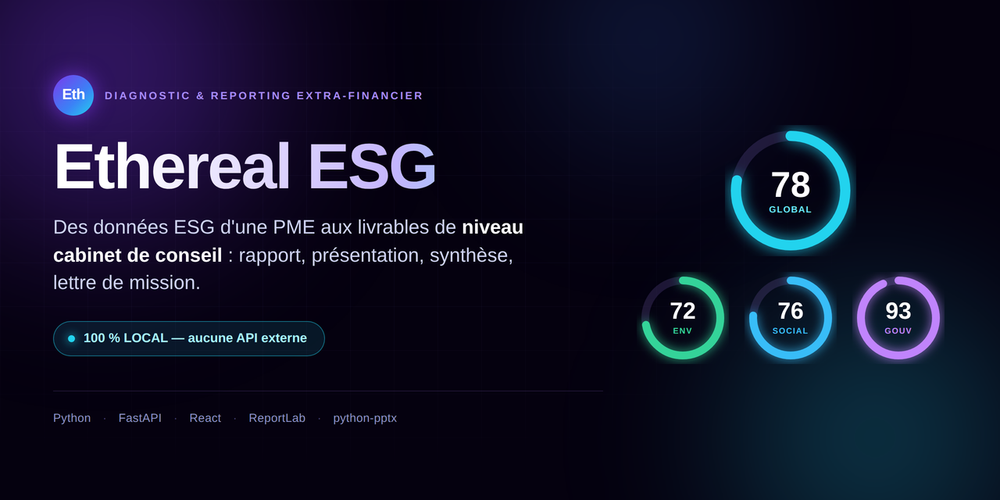
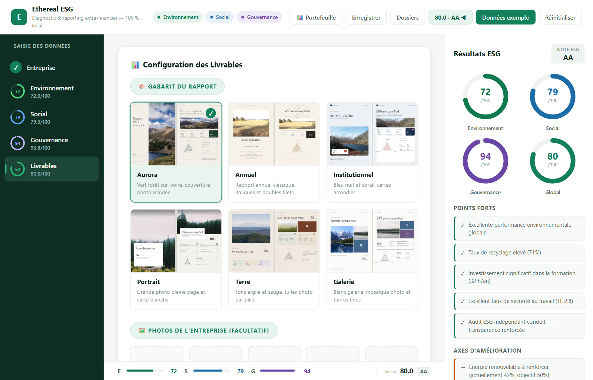
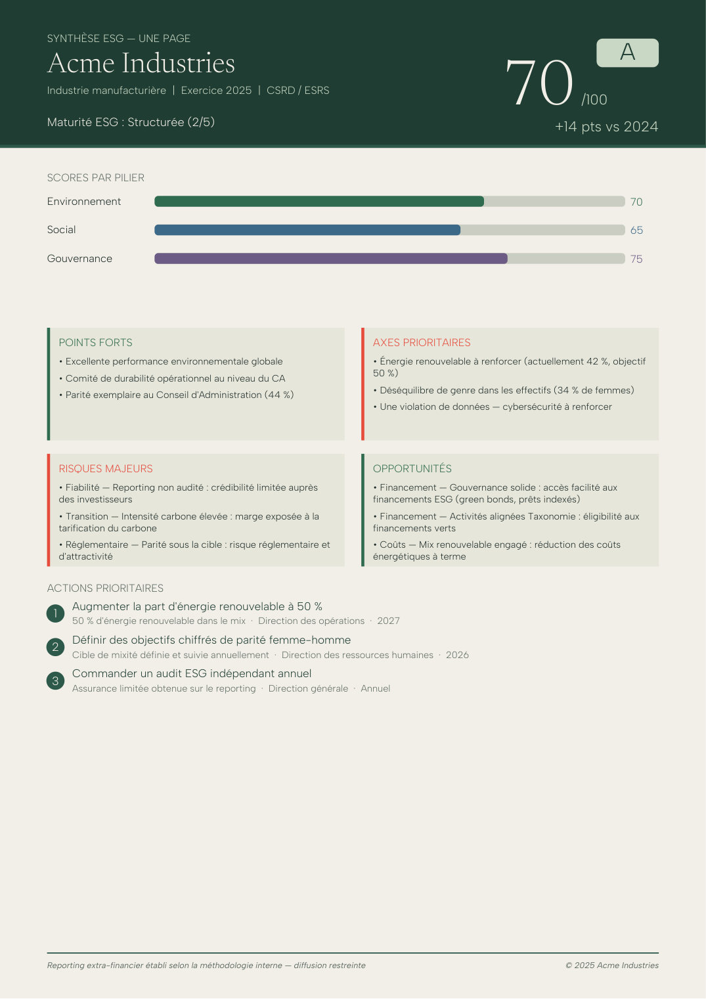
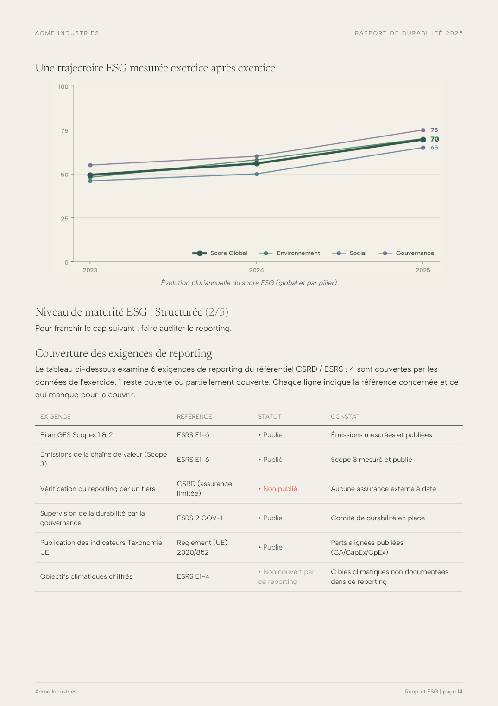
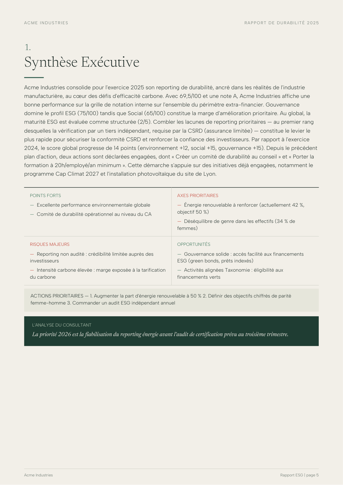
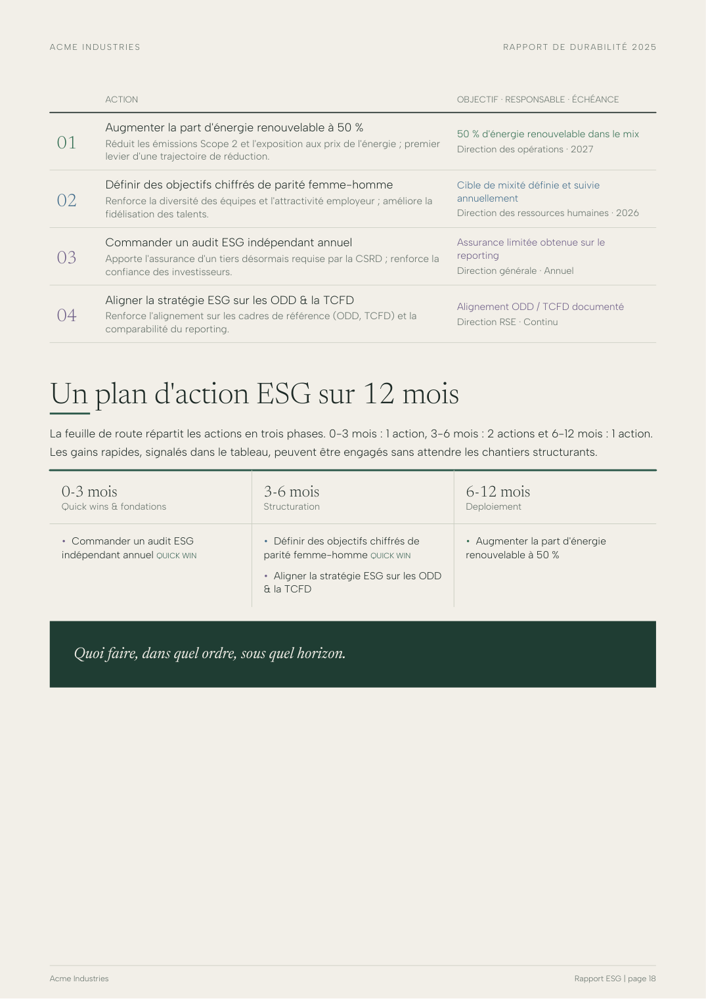
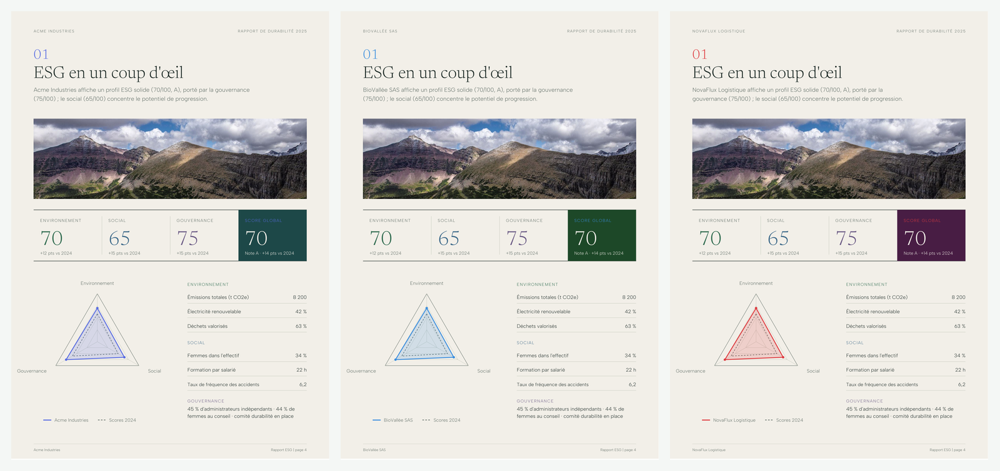
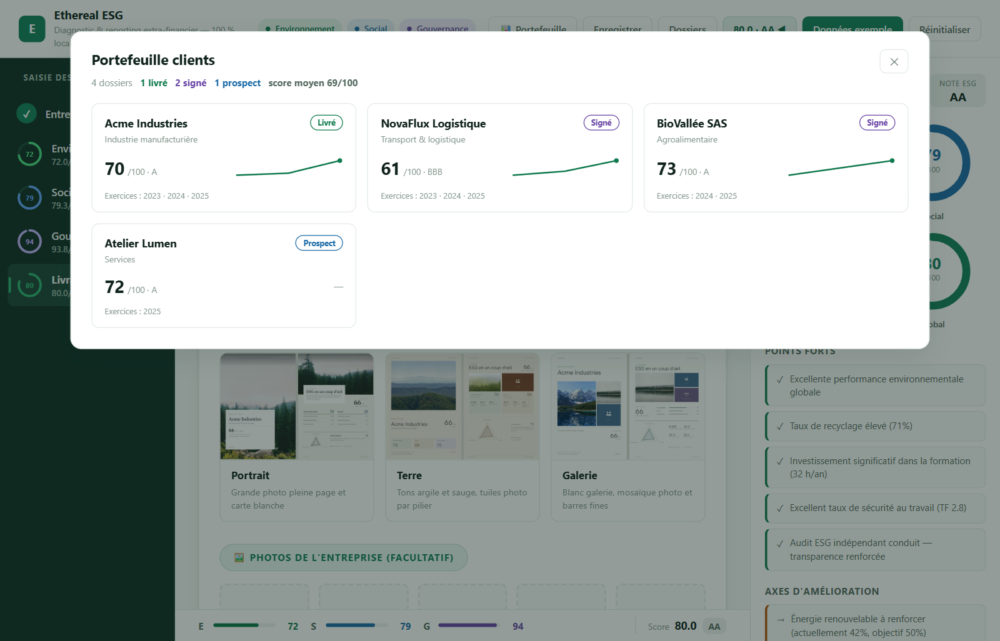
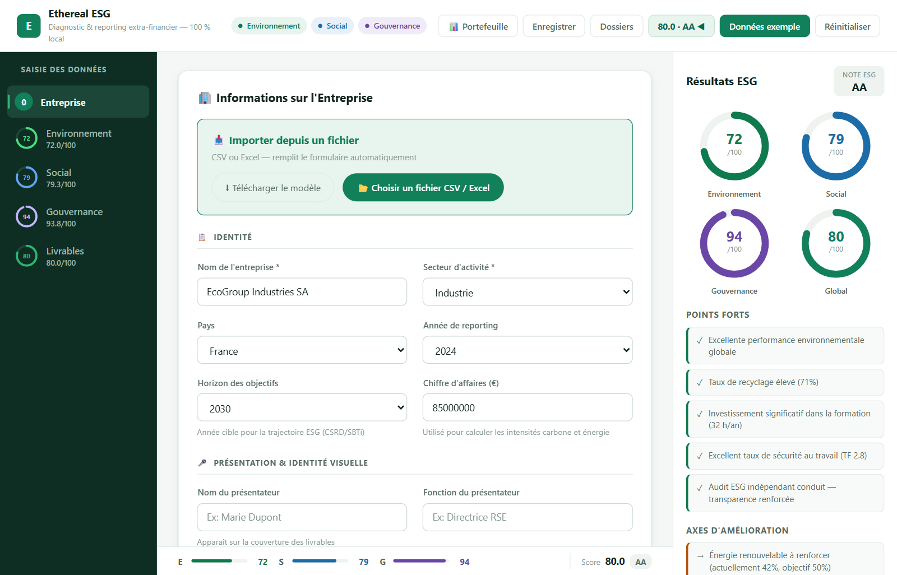

<div align="center">



# Ethereal ESG

**Plateforme de diagnostic et de reporting extra-financier — 100 % locale.**

Transforme les données ESG d'une PME/ETI en livrables de niveau cabinet de conseil :
rapport PDF, présentation de direction, rapport Word, synthèse une page et lettre de mission.
Aucune API externe, aucun compte, aucune donnée qui sort de la machine.

`Python` · `FastAPI` · `React` · `python-pptx` · `ReportLab` · `python-docx` · `matplotlib`

</div>



*L'interface : sept thèmes, déclinaison aux couleurs du client, score calculé en direct.*

---

## Pourquoi 100 % local

Les données ESG d'une entreprise sont sensibles : émissions, effectifs, incidents éthiques,
manquements réglementaires. Les envoyer à un service SaaS ou à une API d'IA générative est un
frein commercial réel — et souvent un interdit chez le client.

Ethereal ESG fait le pari inverse : **tout est calculé et rédigé en local**.

- Pas d'appel réseau au moment de la génération. L'application fonctionne hors ligne.
- Les textes analytiques ne viennent pas d'un LLM mais d'un moteur de rédaction déterministe :
  variation lexicale indexée sur l'entreprise, contexte sectoriel, formulations conditionnées
  par les données réelles.
- Les dossiers clients sont des fichiers JSON sur le disque de l'utilisateur, avec écriture
  atomique et sauvegarde/restauration par archive.

C'est une contrainte d'architecture assumée, pas une limitation : elle devient l'argument
commercial du consultant qui l'utilise (« vos données ne quittent pas ma machine »).

---

## Ce que ça produit

Cinq livrables, générés en un clic à partir du même jeu de données, bilingues **FR/EN**
et déclinables en 7 thèmes graphiques.

| Livrable | Contenu |
|---|---|
| **Rapport PDF** (~17 p.) | Structure en trois actes : Situation · Diagnostic · Plan d'action |
| **Présentation** (21-23 slides) | Deck de comité de direction, titres porteurs de conclusion |
| **Rapport Word** | Même contenu, éditable par le client |
| **Synthèse une page** | Le document que le dirigeant transfère à son conseil |
| **Lettre de mission** | Proposition commerciale bâtie sur le pré-diagnostic réel du prospect |

📂 **[Voir les livrables générés →](examples/)** *(PDF, PPTX, DOCX réels, données fictives)*

<table>
<tr>
<td width="50%"></td>
<td width="50%"></td>
</tr>
<tr>
<td align="center"><em>Synthèse une page : score, trajectoire, risques, top-3 actions</em></td>
<td align="center"><em>Diagnostic : benchmark, trajectoire pluriannuelle, écarts réglementaires</em></td>
</tr>
<tr>
<td width="50%"></td>
<td width="50%"></td>
</tr>
<tr>
<td align="center"><em>Synthèse exécutive : digest décisionnel et analyse du consultant</em></td>
<td align="center"><em>Plan d'action : matrice effort/impact, objectif, responsable, échéance</em></td>
</tr>
</table>

### Une identité visuelle par client

Une palette cohérente est dérivée automatiquement du nom du client (ou saisie à la main).
Trois clients, trois rendus — sans intervention manuelle, et sans toucher aux couleurs
sémantiques des piliers E/S/G.



---

## Le contenu analytique

L'enjeu n'est pas de remplir des pages, c'est de produire un diagnostic défendable devant
un directeur financier. Sans jamais inventer une donnée : ce qui n'est pas renseigné est
affiché comme tel.

- **Double matérialité CSRD/ESRS** — méthodologie IRO en quatre étapes, enjeux réellement
  cotés (impact × matérialité financière) et repris nommément dans le texte.
- **Analyse des écarts réglementaires** — huit exigences (ESRS E1-6, ESRS 2 GOV-1, AFEP-MEDEF,
  Taxonomie UE…) avec statut *conforme / partiel / non conforme / non renseigné* et constat chiffré.
- **Registre des risques** — chaque risque coté impact × probabilité, priorisé P1-P3.
- **Risques climatiques TCFD** — risques physiques et de transition **spécifiques au secteur**,
  sur trois horizons, avec exposition au prix du carbone calculée depuis l'intensité réelle.
- **Benchmark sectoriel** et **maturité ESG** en cinq stades.
- **Plan d'action** priorisé par matrice effort/impact, avec objectif chiffré, fonction
  responsable et échéance.
- **Trajectoire pluriannuelle** dès qu'un client a deux exercices d'historique.

Le scoring différencie les **grilles d'intensité carbone par famille sectorielle** : une même
intensité vaut 40/100 dans les services, 60 dans l'industrie, 70 dans l'énergie. La notation
lettrée est explicitement présentée comme *indicative* et documentée dans une note
méthodologique qui déclare aussi les limites et les points de données manquants.

Un mode **VSME** (norme volontaire PME de l'EFRAG) requalifie les exigences optionnelles
au lieu de les compter comme non conformes.

---

## Le workflow d'une mission

L'application ne s'arrête pas à la génération : elle porte le cycle complet d'une activité
de conseil indépendante.



*La vue portefeuille : statut de mission, dernier score et trajectoire de chaque client.*

| Étape | Dans l'application |
|---|---|
| **Prospection** | Saisie rapide ou import CSV/Excel → score instantané → lettre de mission personnalisée |
| **Mission** | Dossier client sauvegardé, statut (prospect · signé · livré · archivé) |
| **Restitution** | Pack complet : les cinq livrables dans une archive |
| **Suivi** | Les actions réalisées sont cochées et apparaissent comme acquis dans le rapport suivant |
| **Renouvellement** | Chaque exercice enrichit l'historique : évolution N-1 et trajectoire pluriannuelle |
| **Sécurité** | Export/import de tous les dossiers en une archive |

Les analyses libres du consultant sont injectées dans des encarts dédiés
« L'analyse du consultant » — ce qui distingue un diagnostic d'un rapport automatique.



*Saisie guidée en cinq étapes, avec calcul du score en temps réel et import CSV/Excel.*

---

## Points techniques notables

- **Trois moteurs de rendu documentaire** exploités à un niveau inhabituel : ReportLab en
  *canvas* (couverture pleine page, synthèse une page dessinée au point près) **et** en
  *flowables* (rapport paginé), python-pptx avec ajustement automatique de la taille des
  titres, python-docx avec styles et ombrages XML.
- **Système de branding** avec garde-fous de luminance : la couleur primaire est assombrie
  si elle porte du texte blanc, l'accent éclairci s'il devient illisible ; les couleurs
  sémantiques des piliers sont préservées.
- **Encodage typographique** maîtrisé (cp1252/WinAnsi) pour que les accents, l'euro et les
  guillemets français survivent dans les PDF avec polices base-14.
- **Rédaction déterministe** : accords grammaticaux réels (« deux points forts consolidés »,
  jamais « 2 point(s) fort(s) »), déduplication des formules, aucun artefact de publipostage.
- **Persistance robuste** : écriture atomique (fichier temporaire + `os.replace`), validation
  Pydantic stricte de toutes les entrées, middleware ASGI de limitation de taille et
  d'en-têtes de sécurité.
- **34 tests** couvrant les cinq livrables × deux langues × plusieurs thèmes, les endpoints
  de gestion des dossiers, la qualité rédactionnelle et le déterminisme du branding.

```
backend/
├── main.py                 API FastAPI — génération, dossiers clients, sauvegarde
├── models.py               Modèles Pydantic (validation stricte de toutes les entrées)
├── esg_calculator.py       Scoring + grilles carbone sectorielles
├── esg_advanced.py         Matérialité, benchmark, maturité, objectifs
├── content_generator.py    Moteur de rédaction (IRO, écarts, risques, plan d'action)
├── chart_generator.py      Graphiques matplotlib
├── ppt_generator.py        PowerPoint · report_generator.py  Rapport PDF
├── docx_generator.py       Word · onepager_generator.py  Synthèse 1 page
├── proposal_generator.py   Lettre de mission
├── branding.py             Déclinaison aux couleurs du client
├── client_store.py         Dossiers clients (JSON local, écriture atomique)
└── tests/                  Suite pytest
frontend/src/               Interface React (Vite)
```

---

## Démarrage

```bash
# Windows : double-cliquer sur start.bat
# Mac / Linux :
chmod +x start.sh && ./start.sh
```

L'application s'ouvre sur **http://localhost:8000**. Les dépendances sont installées à la
première exécution. Prérequis : Python 3.10+ et Node.js 18+.

```bash
# Tests
cd backend && pip install -r requirements-dev.txt && python -m pytest tests/ -q
```

Les dossiers clients sont stockés dans `backend/data/clients/` (jamais versionnés).

---

## Licence

Code publié à des fins de démonstration et d'évaluation. **Tous droits réservés** —
aucune autorisation de réutilisation, de redistribution ou d'exploitation commerciale
n'est accordée. Pour toute question : ouvrir une issue.
